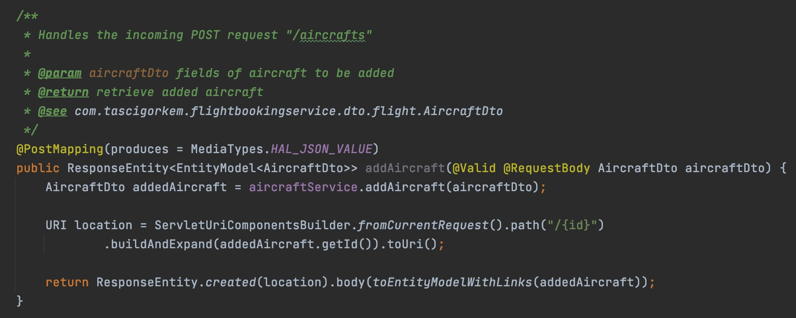

## Flight Booking System

    
    
    
    
    

HATEOAS Driven Rest Api - Microservice Architecture with Spring Cloud, Docker, Kafka and ELK.

### Project Structure

This is a project structure.

All applications in the project are dockerized.

In the center of this schema, you can see Eureka Discovery Server from Spring Cloud Netflix and 2 Spring Boot microservices registered to this server. The first microservice is Restful CRUD API, and it is uses PostgreSQL as a database. The second microservice is a mail sending service, and it is uses MailHog for SMTP testing.

In addition to these, 2 microservices communicate with each other with Apache Kafka and Zookeeper. API service sends message to Kafka and mail sending service receives this message and sends it by e-mail.

Also, elastic stack used for log-analysis solution. Filebeats binds the dockerized container logs and ships these to ElasticSearch. Then, Kibana visualize these logs.

### HATEOAS Driven REST API

HATEOAS (Hypermedia as the Engine of Application State) is a constraint of the REST application architecture that lets us use the hypermedia links in the response contents. It allows the client can dynamically navigate to the appropriate resources by traversing the hypermedia links.

JSON Hypermedia API Language (HAL) is a response's content-type: application/hal+json with pagination.

### Docker

All applications in this project are dockerized. To achieve this, 3 docker-compose files are created.

Then, all applications can be started with a single docker-compose command:

`
docker-compose -f docker-compose-app.yml -f docker-compose-elk.yml -f docker-compose-kafka.yml up --build -d
`

PS: For local development, up docker-compose-kafka-local.yml, then start microservices.

`
docker-compose -f docker-compose-kafka-local.yml up -d
`

### Test & Validation

JUnit5, Mockito and Github-Faker are used in this project.

This snippet shows that unit test for Get by id request and usage of Arrange-Act-Assert (3A) pattern. Additionally, checks status of response.

This snippet checks whether expected and returned objects are equal according to the fields.

This snippet checks whether invalid request returns the HTTP status 400 Bad Request.

### Database

Used PostgreSQL as database.

DB Diagram:

`spring.datasource.initialization-mode:always` for database initialization from schema.sql

Database Schema Generation - Sql: `./flight-booking-service/src/main/resources/schema.sql`

Database Inserts - Sql: ./flight-booking-service/src/main/resources/db-inserts.sql`

BaseEntity class with `@MappedSuperClass` annotation and is used by all entity classes as a super class. BaseEntity consists of id, creationTimestamp, updateTimestamp and deletionTimestamp fields.

Additionally, there are ManyToOne and OneToMany relations between entities.

### Kafka & ElasticSearch

**Kafka Producer** in microservice 1(flight-booking-service), that sends the email message  to Kafka.

**Kafka Consumer** in microservice 2(mail-service), that receives the published email message from Kafka and sends it by e-mail.

MailHog, that catches e-mail was sent by microservice 2(mail-service).

Additionally, this whole process can be monitored and analyzed through Kibana with Elasticsearch.

### Docs

Docs located `./docs` folder in the main project folder.

#### Javadoc

Used javadoc standards for method comments.

Run `mvn javadoc:javadoc` for create javadocs.

#### Swagger & Api-Docs

Used Swagger and Api-Docs for RestAPI endpoints.

`http://localhost:8081/swagger-ui/index.html?configUrl=/api-docs/swagger-config`

## Notes & Scenario

**Scenario:** Create a new customer, create a new flight and customer books this flight

...

## References

...

## License
Restaurant Service is developed under the [MIT License](LICENSE).
